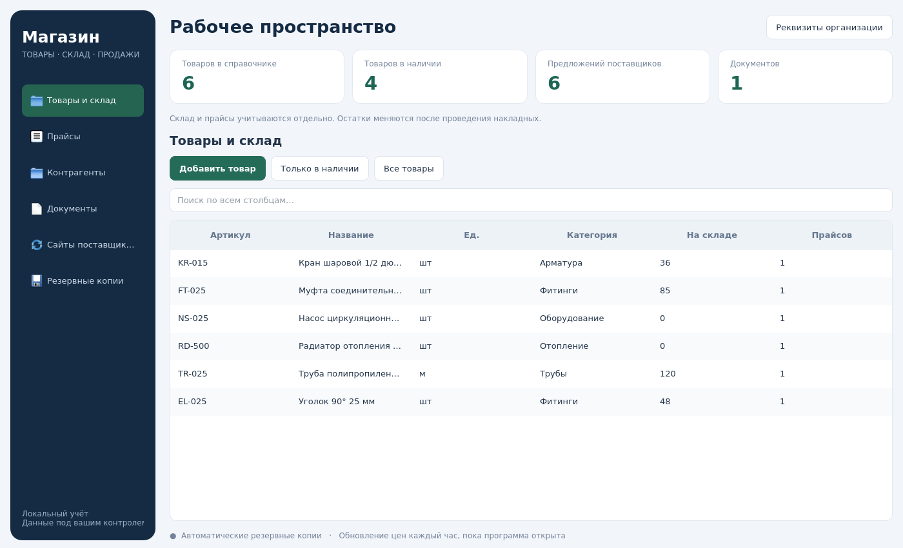

# Магазин

Скачайте [Magazin.zip](Magazin.zip?raw=true) и распакуйте архив целиком.

В Windows установите Python 3.12 с Python Launcher, затем запустите `start_shop_windows.bat`. При первом запуске нужен интернет для установки зависимостей. Это архив исходной настольной программы, не Windows EXE; запуск на Windows ещё не проверен.

Инструкция находится в архиве: `README.txt` и `docs/MAGAZIN_GUIDE_RU.md`. Программа использует свою базу `shop.db` и не изменяет данные СМЕТА-ГАЗ.

Проверки: 15 тестов учёта, прайсов, шаблонов и резервных копий; сценарий интерфейса с шестью разделами; отдельный запуск и проверки извлечённого архива в Linux/offscreen Qt.
